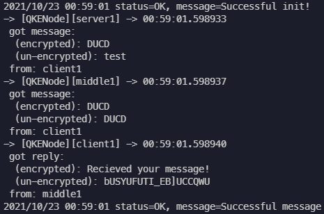

# Quantum Key Exchange

## Tests
Testing logic in main_test.go and in other packages

**Running all tests**

Can run all tests from this go module import path with:
```
go test quantum-key-exchange/... -v
```

Or simply run all tests in this directory and sub directories with:
```
go test ./... -v
```

## The algorithum

In the screenshot below there is an example of the quantum key exchange test (found from the qkenode-test.go file).



We can see that the server recieved the message from the client and was able to decrypt it however, the man in the middle (MITM) did not have access to the key as it was never sent with the message. In this sense the algorithm works well.

If the MITM were to snoop on the initial exchange of information to form the secret key using classical channels, the MITM would be able to decode the the secret key however that is the limitation of this emulation, as in practice classical channels would only be used during the exchange of the polarization filters used, in which case a MITM would alter the state of any photons thus making the algorithm work well.

A recommendation would also be to use digital signature technology throughout all steps to ensure that parties know who they are communicating with from start to finish, as an attacker could still pretend to be the real recipient if that avenue is ignored.